# Apple Container Desktop: A GUI For Apple Container

## ⭐ [2.0.0](https://github.com/0Itsuki0/AppleContainerDesktop/releases/tag/2.0.0) is released with Docker Compose support! ⭐

A GUI for [Apple container](https://github.com/apple/container), a tool that we
can use to create and run Linux containers as lightweight virtual machines on
Mac.

> [!IMPORTANT]
> The newest version is for container
> [1.1.0](https://github.com/apple/container/releases/) which may contain some
> breaking changes. Please make sure to download the newest binary release for
> apple container in the
> [release page](https://github.com/apple/container/releases/tag/1.1.0).

## Perquisite

This app will not automatically download `container` so please make sure to
install it either from the [GitHub](https://github.com/apple/container) or by
running `brew install --cask container`.

## Installation (Main GUI App)

You can either download the entire repository and run/build it with Xcode or you
can download the latest signed `dmg` for the app from the
[GitHub release page](https://github.com/0Itsuki0/AppleContainerDesktop/releases).

## (Optional) Installation (Helper CLI)

CLI is a helper tool for the GUI to navigate to specific views, and open up
specific dialogs. Currently, it only supports compose-related operations.

Please refer to the [Helper CLI](#helper-cli) for more details.

1. Open `AppleContainerDesktop_<version>.dmg`.
2. In the mounted volume, run the installer from Terminal:

```bash
/Volumes/AppleContainerDesktop/install.sh
```

This will copy `container-desktop`(CLI) to `/usr/local/bin`.

3. Verify:

```bash
container-desktop --help
```

**To uninstall:**

```bash
sudo rm /usr/local/bin/container-desktop
```

## Basic Usage

After downloading both the `container` executable as well as this app, simply
launch the app.

By doing so, this app will try to find the `container` executable in the default
location, ie: `/usr/local/bin/container`, and start the system. If the
executable is not found, you will see the following prompting for setting a
custom path and retry.

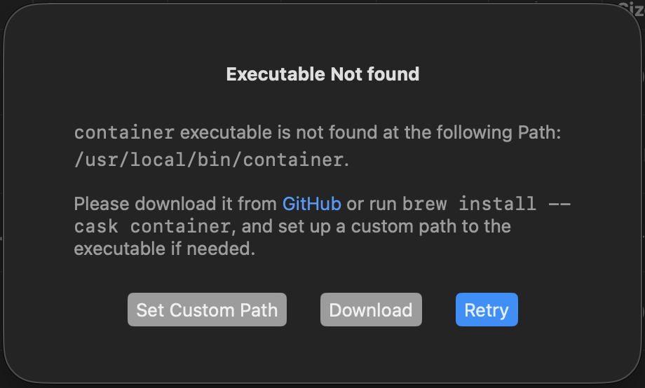

After system started correctly, we can then interact with the images and
containers.


## Current Features

### Compose

- Create/delete compose project
- build/up/down/rm compose

**Supported features**

Features such as Multi-compose, whether that is the multi-file merge (similar to
the -f option), the Include, or the extend. Custom env files (of course) custom
project name Select services / profiles to build, up, down, remove handling up /
down order wait for different depends_on conditions attach network attach
volumes different deploy options such as container replicas are all supported

**Not Supported**

(Mainly due to Apple container's implementation difference from Docker.)

1. Disable ipV4 and ipV6 not supported (as of current implementation of
   Container)
2. Remote OCI not supported
3. build.network not supported when building an image from dockerfile (as of
   current implementation of Container)
4. service.develop, configs, hooks, volumes_from not supported
5. network alias not supported (as of current implementation of Container)
6. replica not supported for named volumes (as of current implementation of
   Container)
7. auto recreate on images/volumes/networks when configuration changed

#### Create New Compose Project

A compose project needs to be created first in order to up/down services.

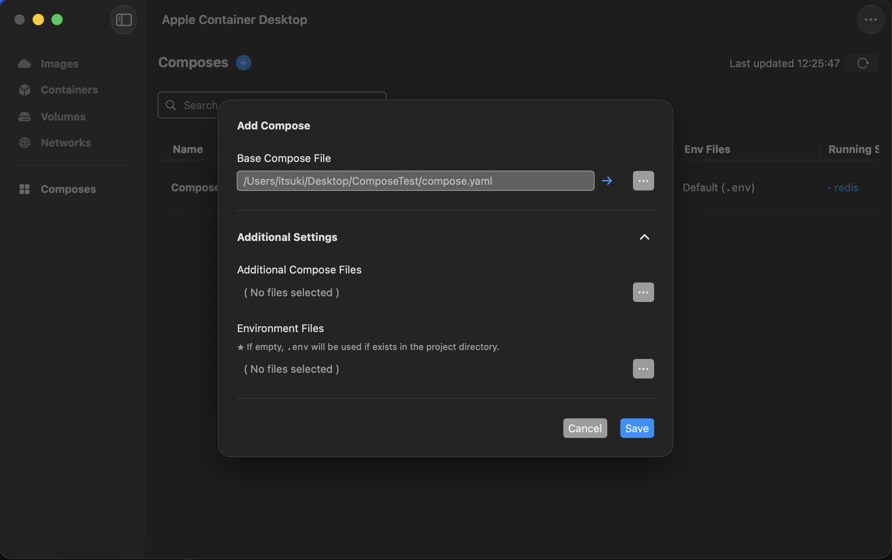

#### Inspect Composes

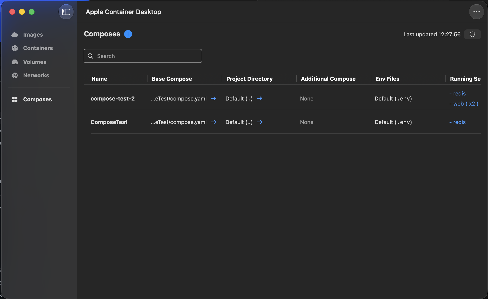

#### Compose Up / Build

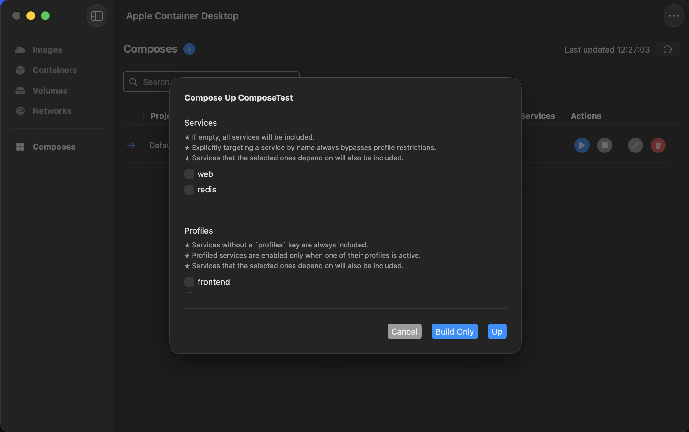

#### Compose Down / Remove

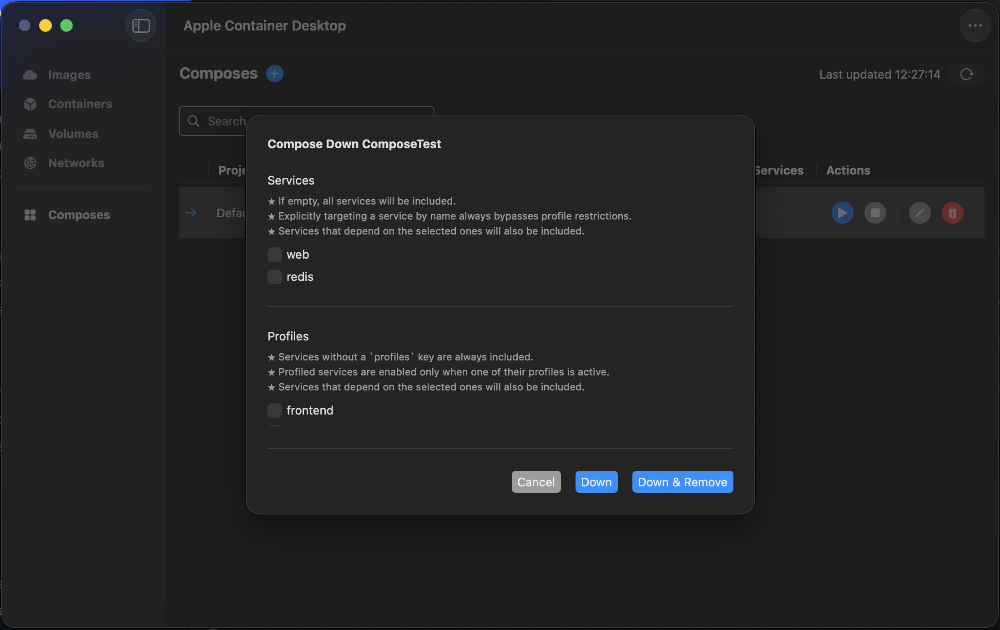

### Images

- Pull Remote Image
- Build Image from Dockerfile
- Save Image(s) as OCI compatible tar archive
- Load Image(s) from OCI compatible tar archive
- Delete Image
- Inspect some basic Image information such as container using the image, OS,
  Arch, and etc.

#### Pull Remote


#### Build From Dockerfile

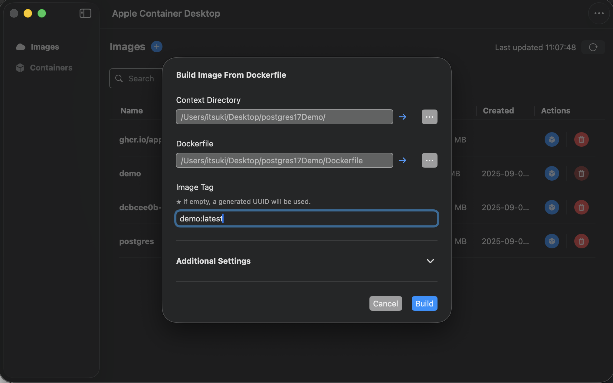

#### Save Images


#### Load Images


### Containers

- Create new container
  - From added image, or directly from remote references
  - Set custom name, add published ports and environment values


- Start, stop, or delete containers
- Inspect container
  - Status, OS, Arch, published ports, environment variables, and logs.


### Volumes

- inspect basic volume information such as container using the volume, size,
  source, and etc.


- Create and delete volumes


- Mount volumes to container


### Networks

#### Inspect Networks

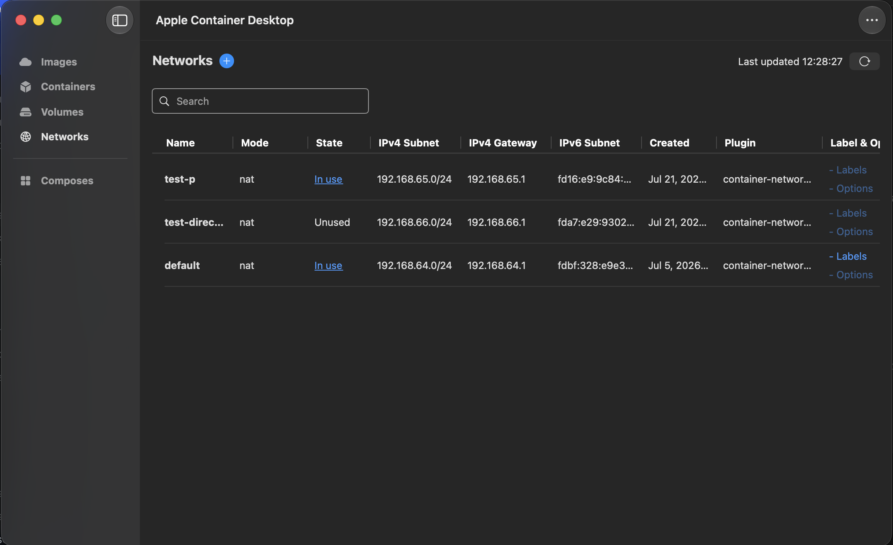

#### Create Networks

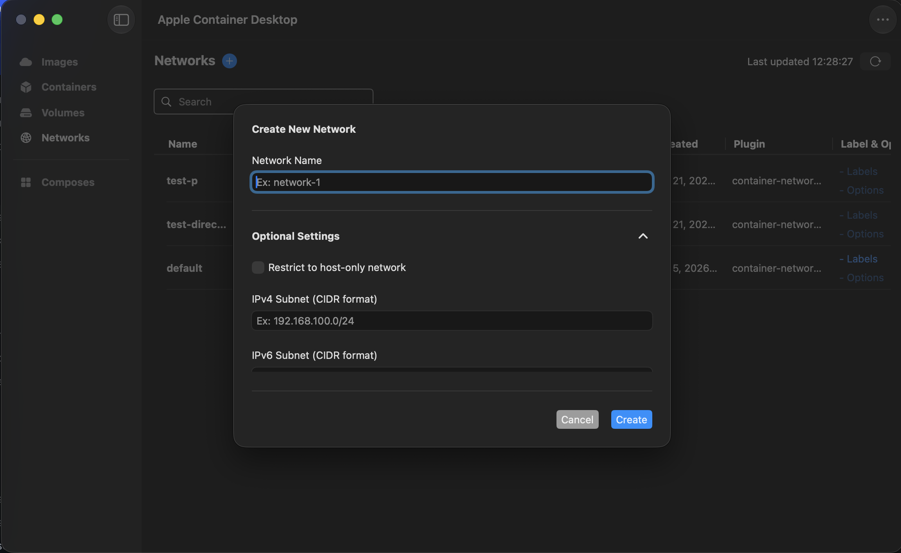

### Helper CLI

The `container-desktop` CLI is a helper tool for the GUI App to navigate to
specific views, and open up specific dialogs.

#### compose SubCommand

container-desktop compose <path> [--action <up|down>]

- `<path>` — a compose file, or a directory containing one. If a directory is
  given, the first match is used, in this order: `compose.yml`, `compose.yaml`,
  `docker-compose.yml`, `docker-compose.yaml`.
- `--action` — optional. `up` or `down`. Omit to just open up (select) the
  compose project in the app.

**Notes**

- If the specified compose file / directory is not added as a compose project
  yet, it will be created automatically.
- if `up` or `down` is specified, the dialog for configuring compose-up or
  compose-down will be opened for the project.

**Examples**

```bash
# Resolve a compose file in the current directory and open it
container-desktop compose .

# Point at a specific file
container-desktop compose ./docker-compose.yml

# Open and bring the stack up
container-desktop compose ./myapp --action up

# Open and bring the stack down
container-desktop compose ./myapp --action down

# Help
container-desktop compose --help
```

**Demo**

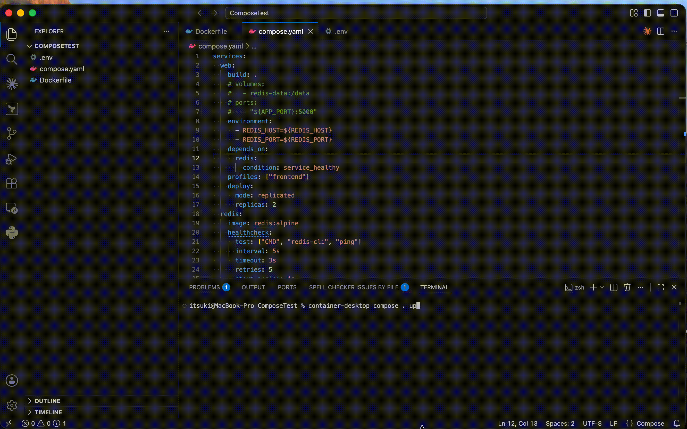

### Others

Set Custom values for

- Path to `container` executable
- Application Data
- Time out time for starting and stopping the system, as well as stopping the
  container.

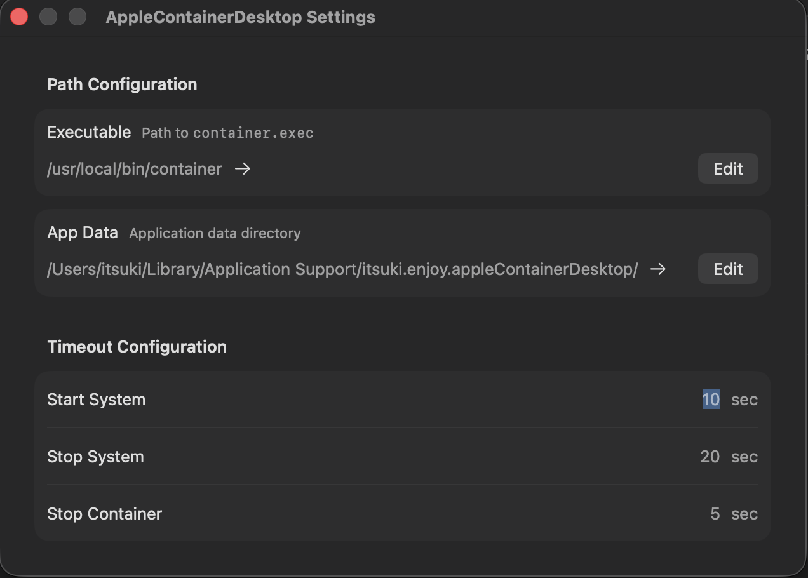

Interact with the container system through the menu if needed.

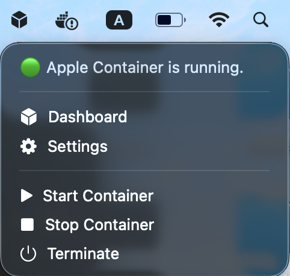

## Coming Soon

### Images

- Inspect Image with detail
- Add additional configurations for pulling / building images
- Tag and push images to remote repositories

### Containers

- More options when creating containers such as Adding mounts (file systems /
  volumes) to the container, specifying user, environment variables, and etc.
- Add more details when inspecting container
- Interact with (execute terminal command on) container

If there is more you would like to see, please leave me a comment somewhere!
Will be happy to know!

## Blogs

- [A Simple GUI For Apple Container. Like the Docker Desktop!](https://medium.com/@itsuki.enjoy/a-simple-gui-for-apple-container-like-the-docker-desktop-f16148c8bcc0)
- [Apple Container Usage In Details](https://medium.com/@itsuki.enjoy/apple-container-usage-in-details-ed3293aa8d3d)
- [+ Compose Support! Said my Apple Container Desktop!](https://medium.com/@itsuki.enjoy/docker-compose-support-said-my-apple-container-desktop-db5b12b216aa)
